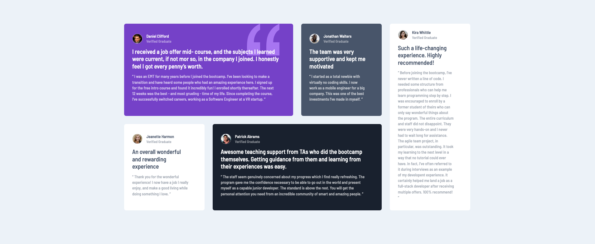
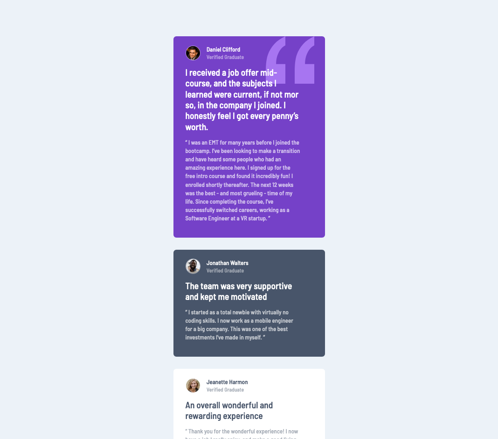

# Frontend Mentor - Testimonials grid section solution

This is a solution to the [Testimonials grid section challenge on Frontend Mentor](https://www.frontendmentor.io/challenges/testimonials-grid-section-Nnw6J7Un7). Frontend Mentor challenges help you improve your coding skills by building realistic projects.  

 

## <b>Table of contents</b>

- [Screenshots](#screenshots)
- [Links](#links)
- [Built with](#built-with)
- [Mentions](#mentions)
- [My social profiles](#profiles)

 

---

 

## Screenshots

 

Desktop

Mobile

 

---

 

## Links

 [Solution Frontend Mentor]()

 [Live site with GitHub Pages]()

 

---

 

## Built with

 

 

 

 

----

 

## Mentions

I have used and modified Eduardo Fierro's reset, here is the repository.  
[Eduardo's reset repository.](https://github.com/eduardofierropro/Reset-CSS)

 

---

 

<b><h2 id="profiles" align="center">My social profiles</h2></b>

  
  
  
  

 

---

 

 
  <i>Created with a lot of</i>
   
  

